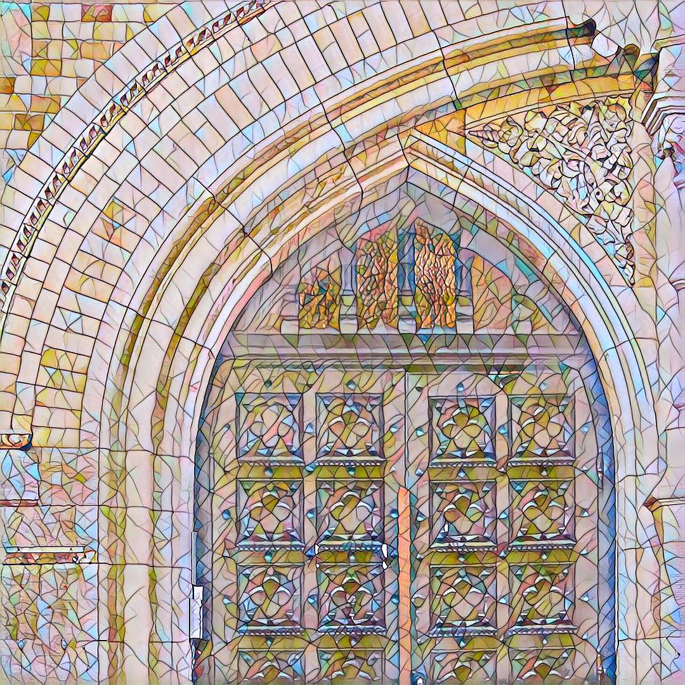
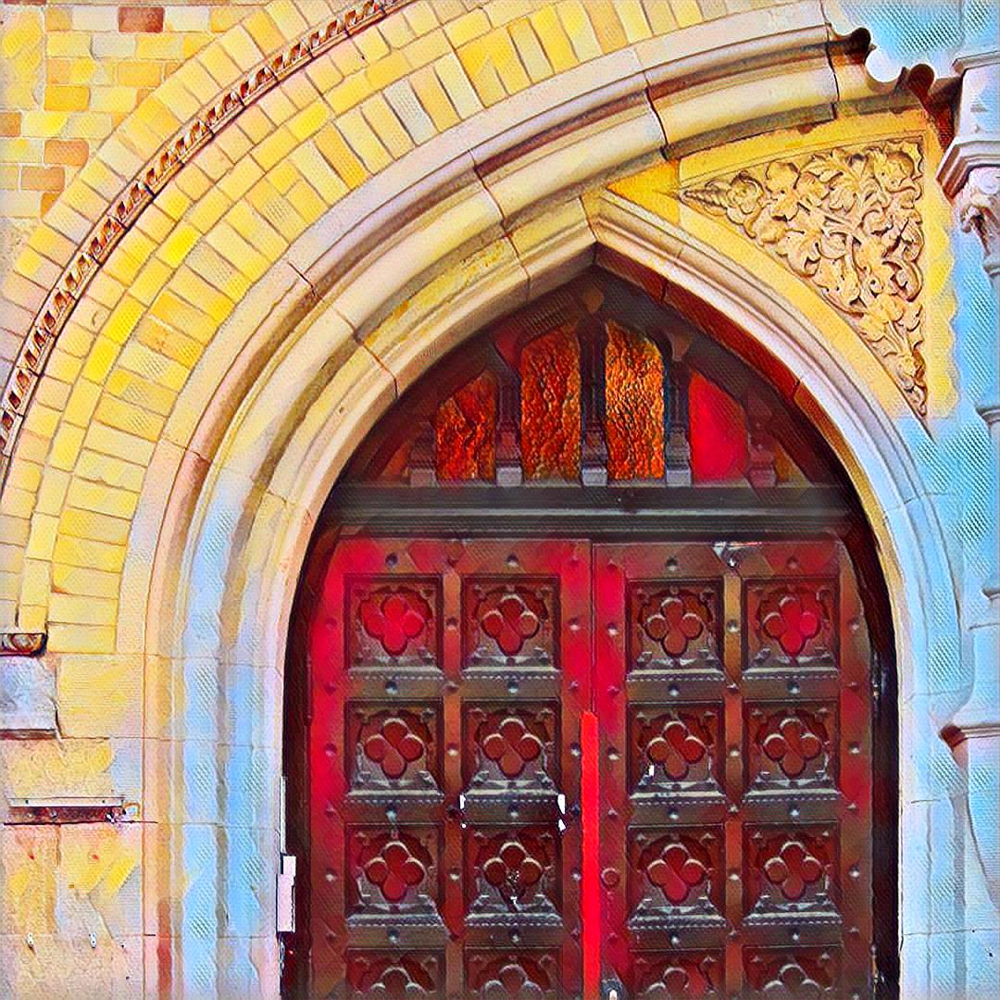
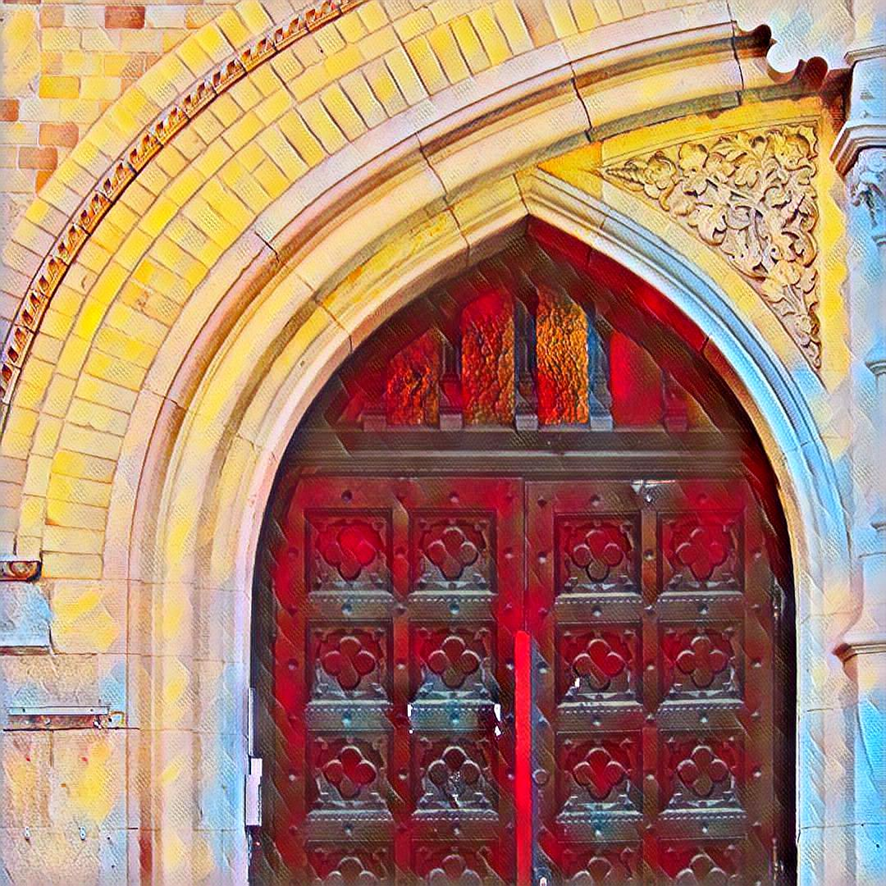
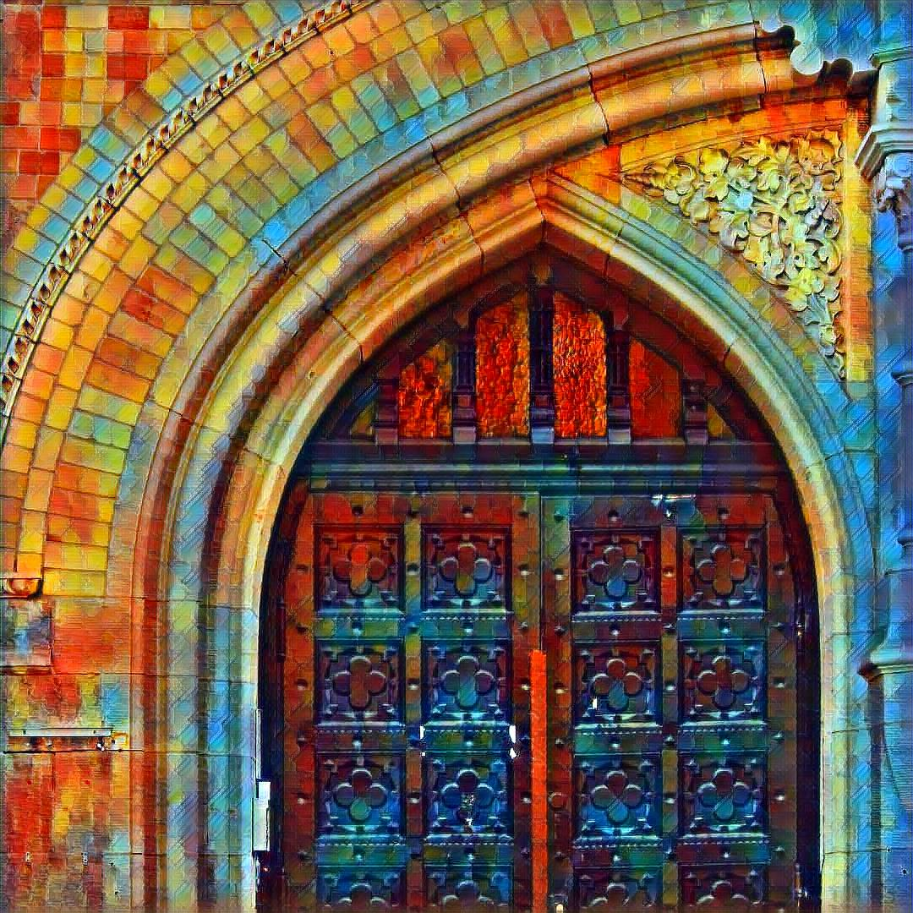
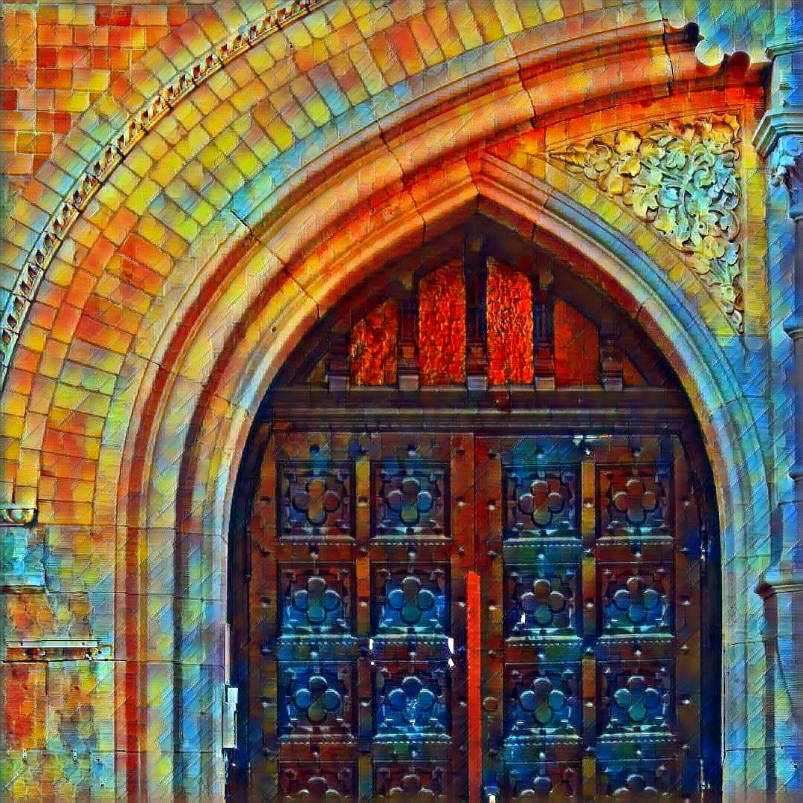
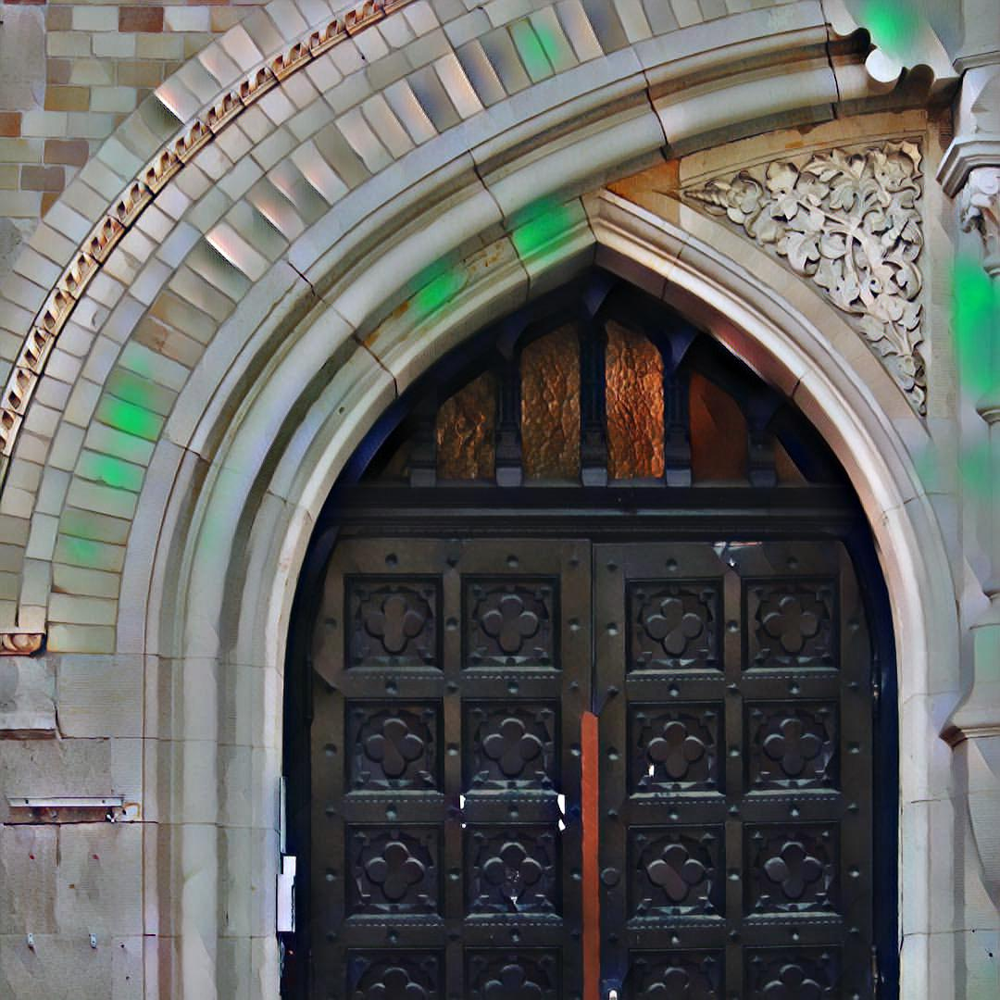
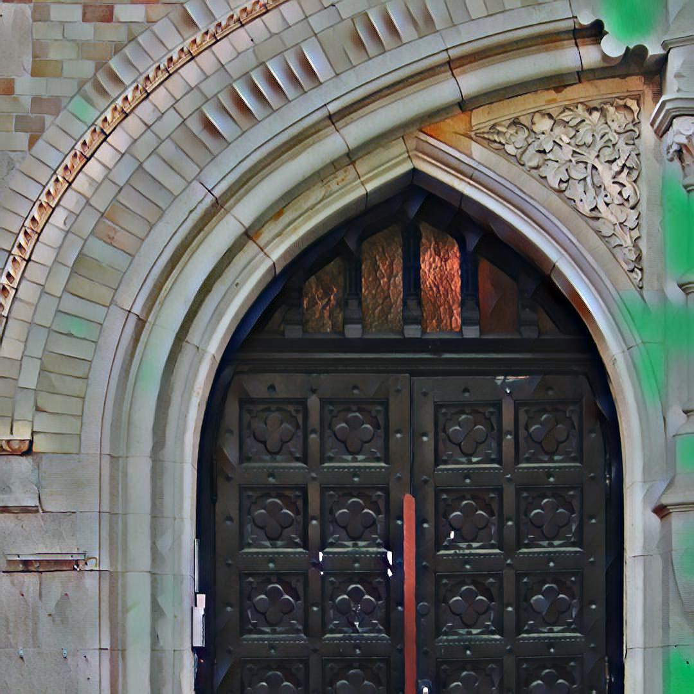

# Run PyTorch fast-neural-style (FNS) example with ONNX.js in web browsers
This repo is a fork of PyTorch [fast-neural-style (FNS) example](https://github.com/pytorch/examples/tree/master/fast_neural_style).  The example has built-in ONNX export that works with [ONNX Runtime](https://github.com/Microsoft/onnxruntime), but that's about it.  This fork is to modify the FNS example so it runs with [ONNX.js](https://github.com/Microsoft/onnxjs) in web browsers.

Performance is not the key consideration here, but to make it runnable in target deep learning framework, such as web browsers with ONNX.js.  Many workarounds are needed to make the neural-style-transfer run in ONNX.js.  This repository is to find out what it takes to make the model conversion a successful one.

It follows the process:  
<p align="center"><b>PyTorch&nbsp;fast-neural-style&nbsp;(FNS)&nbsp;examples --> PyTorch&nbsp;model&nbsp;files&nbsp;(.pth/.model) --> ONNX&nbsp;model&nbsp;files (.onnx) --> ONNX.js&nbsp;on&nbsp;web&nbsp;browsers</b></p>

As both PyTorch and ONNX.js are being updated frequently, to minimize the scope of change, _most changes happens in this fork of fast-neural-style example only_.

This repo is based on [PyTorch v1.0](https://pytorch.org/get-started/locally/) and [ONNX.js v0.1.3](https://github.com/Microsoft/onnxjs/tree/v0.1.3)/[v0.1.4](https://github.com/Microsoft/onnxjs/tree/v0.1.4) running on Windows 10 or Ubuntu 18.04.

#### Quick links:
- Goto [PyTorch fast-neural-style web benchmark](https://gnsmrky.github.io/pytorch-fast-neural-style-onnxjs/benchmark.html) as a quick demo with ONNX.js running on web browsers.

- See [Making the PyTorch to ONNX.js conversion work](docs/readme.md) in `docs` folder if you are interested in more technical details.

- [Setup and convert pre-trained PyTorch FNS model files](#setup-and-convert-pre-trained-pytorch-fns-model-files-pth-to-onnx-onnx)

- [System resource considerations](#system-resource-considerations)

- [Eval/export ONNX for smaller input image sizes for ONNX.js web inference](#Evalexport-ONNX-for-smaller-input-image-sizes-for-ONNX.js-web-inference)

- [Reduced model for lower system resource requirement and faster inference time](#Reduced-model-for-lower-system-resource-requirement-and-faster-inference-time-67mb-vs-17mb-file-sizes)

- [Stylized image output with reduced model](#stylized-image-output-with-reduced-model)

- [Python snippets - Export pre-trained model file (.pth) to ONNX (.onnx) with smaller image input sizes](#python-snippets---export-pre-trained-model-file-pth-to-onnx-onnx-with-smaller-image-input-sizes)

- [Python snippets - Export reduced model (.model) to ONNX (.onnx)](#python-snippets---export-reduced-model-model-to-onnx-onnx)


## Setup and convert pre-trained PyTorch FNS model files (.pth) to ONNX (.onnx)
1. Setup PyTorch - Follow the instructions at [PyTorch get started](https://pytorch.org/get-started/locally/) page:
   - Set up CUDA if necessary.  (If only CPU is desired, install PyTorch 1.0 for CPU.)
   - This repo is based on PyTorch v1.0 `pip` installation with Python 3.6.
   - Windows 10 + nVidia GPU (CUDA 10.0):  
     ```
     pip3 install https://download.pytorch.org/whl/cu100/torch-1.0.0-cp36-cp36m-win_amd64.whl
     pip3 install torchvision
     ```
   - Ubuntu 18.04 + nVidia GPU (CUDA 9.0):
     ```
     pip3 install torch torchvision
     ```
   
2. Clone this repository and download pre-trained models:
   - Clone this repo: `git clone https://github.com/gnsmrky/pytorch-fast-neural-style.git`
   - **Download and extract pre-trained model files.**  
     `python download_saved_models.py`
   - The 4 pre-trained `.pth` model files will be extracted automatically to `saved_models` folder:  
   `candy.pth`, `mosaic.pth`, `rain_princess.pth` and `udnie.pth`

3. Setup ONNX:
   - `pip install onnx`
   - [ONNX](https://github.com/onnx/onnx) GitHub repository.
4. Run inference eval and export the `.pth` model to `.onnx` files:  
   - Ubuntu 18.04 + nVidia GPU (CUDA): Convert `mosaic.pth` to `mosaic.onnx`:

      ```
      python neural_style/neural_style.py eval --model saved_models/mosaic.pth \
              --content-image images/content-images/amber.jpg --output-image amber_mosaic.jpg \
              --export_onnx saved_onnx/mosaic.onnx --cuda 1
      ```
   - Windows 10 + nVidia GPU (CUDA): Convert `mosaic.pth` to `mosaic.onnx`

      ```
      python neural_style/neural_style.py eval --model saved_models/mosaic.pth ^
              --content-image images/content-images/amber.jpg --output-image amber_mosaic.jpg ^
              --export_onnx saved_onnx/mosaic.onnx --cuda 1
      ```
   - The exported `mosaic.onnx` model file is saved in `saved_onnx` folder.
   - With CPU: specify `--cuda 0` in the above python command line.
   - The output image `amber_mosaic.jpg` is created.

The generated `mosaic.onnx` model file can then be inferenced by ONNX.js in supported web browsers.  However, the `.onnx` model file may be too large to run in web browsers.  Read on for additional works to make it runnable in web browsers.

## System resource considerations
When running PyTorch inference eval on a memory resource limited systems, such as CPU + 8GB of RAM (i.e. Intel HD Graphics 520) or GPU + 2GB VRAM (i.e. nVidia MX150), the eval may result in **`Segmentation fault (core dumped)`** error.  This is mainly due to insufficient memory when doing inference run.  PyTorch needs to run inference to build model graph.  One quick way around this is to reduce the content image size by specifying `--content-scale`.  Specify `--content-scale 2` would resize the content image to half for both width and height.  

In the above inference eval, `amber.jpg` is an image of size 1080x1080.  `--content-scale 2` would scale down the image size to 540x540.  
```
python neural_style/neural_style.py eval --model saved_models/mosaic.pth --content-scale 2 --content-image images/content-images/amber.jpg --output-image amber_mosaic.jpg --export_onnx saved_onnx/mosaic.onnx --cuda 1
```

(Reduced content size does not create smaller `.onnx` model file.  It simply reduces the amount of resources needed for the needed inference run.  In the exported `.onnx` model files, only the sizes of input and output nodes are changed.)

## Eval/export ONNX for smaller input image sizes for ONNX.js web inference
Goto [PyTorch fast-neural-style web benchmark](https://gnsmrky.github.io/pytorch-fast-neural-style-onnxjs/benchmark.html) as an example for quick demo.  The benchmark runs image sizes at 128x128 and 256x256 to avoid the constrained resource situation.

When doing inference eval with ONNX.js, the available resource is even more limited in web browsers.  It is recommended to lower down the content image size even futher to 128x128 and 256x256 using `--content-scale` option.

To export `candy.pth` to have 256x256 input image size.  `--content-scale` is set to `4.21875` (1080 / 256 = 4.21875).  
<code>python neural_style/neural_style.py eval <b>--content-scale 4.21875</b>  --model saved_models/candy.pth --content-image images/content-images/amber.jpg --cuda 1 --output-image amber_candy_256x256.jpg --export_onnx saved_onnx/candy_256x256.onnx
</code>

Goto [Python snippets for smaller image input sizes](#python-snippets-for-smaller-image-input-sizes) for the complete list.


## Reduced model for lower system resource requirement and faster inference time (~6.7MB vs ~1.7MB file sizes)
Resizing input content image does not reduce the model file size.  It only reduce the resource needed when running inference eval.  Convolution that sweeps smaller images needs smaller memory footprint.  The number of parameters in the network, however, is kept the same.

PyTorch FNS example was trained with 32 channels to start with for the 1st convolution layer.  To reduce the model file size, the quickest way is to reduce the number of channels (or number of filters) in the network.  _This **requires retraining** the network as there are fewer channels and parameters._  The newly trained weights are stored in PyTorch model files (.model).

With half the number of channels at 16, and similarly done so for all the following layers, the model file size is reduced to ~1/4 the size.  

The newly trained model files are provided in `saved_models_nc16` folder.  Specify `--num-channels 16` when running inference eval with reduced network model files.  The corresponding exported ONNX model files for 128x128 and 256x256 content image size are in `saved_onnx_nc16` folder.  (Due to fewer channels, the `--batch-size=1 (default is 4)` was used when doing training so style features are not batch normalized as much.)

Also listed here is the model using `--num-channels 8`.

### Model comparison:

|&nbsp;|Original&nbsp;model<br/>(.pth)|Reduced&nbsp;model<br/>(.model)|Reduced&nbsp;model<br/>(.model)|
|:-:|:-:|:-:|:-:|:-:|
|<code>&#x2011;&#x2011;num&#x2011;channels</code>|32|16|8|
|<code>&#x2011;&#x2011;batch&#x2011;size</code>\*|4|1|1|
|File&nbsp;size|~6.7MB|~1.7MB|~0.43MB|
|# of params\*\*|~1.68M|~0.42M|~0.11M|
|ONNX file size\*\*\*|~7MB|~2MB|~0.81MB|
\* `--batch-size` is only used during training to reduce level of image feature normalization.  This option is _not_ required when running inference eval.  
\*\* Use `model_count_params.py` to count parameters in PyTorch (`.pth` or `.model`) or ONNX (`.onnx`) model files.  
\*\*\* ONNX model file is a bit larger due to the network graph is also stored in the file.  

## Stylized image output with reduced model
The results are shown in the following table.  The stylized image from reduced model is quite similar to the original model.  Yet the model size and total parameter count is reduced by ~75%.

<div align='center'>
  <br/>
  Content image - <b>amber.jpg</b>
  <br/>
</div>
<br/>
<div align='center'>
<table>
  <th>Style Image</th>
  <th>Original Model (.pth)<br/> <code>--num-channels=32</code><br/><code>--batch-size=4</code></th>
  <th>Reduced Model (.model)<br/> <code>--num-channels=16</code><br/><code>--batch-size=1</code></th>
  <th>Reduced Model (.model)<br/> <code>--num-channels=8</code><br/><code>--batch-size=1</code></th>
  <tr>
    <td><br/><center>mosaic.jpg</center></td>
    <td><a href="images/output-images/amber-mosaic.jpg"></a><br/>&nbsp;</td>
    <td><a href="images/output-images/amber-mosaic_nc16.jpg"></a><br/>&nbsp;</td>
    <td><a href="images/output-images/amber-mosaic_nc8.jpg"></a><br/>&nbsp;</td>
  </tr>
  <tr>
    <td><br/><center>candy.jpg</center></td>
    <td><a href="images/output-images/amber-candy.jpg"></a><br/>&nbsp;</td>
    <td><a href="images/output-images/amber-candy_nc16.jpg"></a><br/>&nbsp;</td>
    <td><a href="images/output-images/amber-candy_nc8.jpg"></a><br/>&nbsp;</td>
  </tr>
  <tr>
    <td><br/><center>rain-princess-cropped.jpg</center></td>
    <td><a href="images/output-images/amber-rain-princess.jpg"></a><br/>&nbsp;<br/>&nbsp;</td>
    <td><a href="images/output-images/amber-rain-princess_nc16.jpg"></a><br/>&nbsp;<br/>&nbsp;</td>
    <td><a href="images/output-images/amber-rain-princess_nc8.jpg"></a><br/>&nbsp;<br/>&nbsp;</td>
  </tr>
  <tr>
    <td><br/><center>udnie.jpg</center></td>
    <td><a href="images/output-images/amber-udnie.jpg"></a><br/>&nbsp;</td>
    <td><a href="images/output-images/amber-udnie_nc16.jpg"></a><br/>&nbsp;</td>
    <td><a href="images/output-images/amber-udnie_nc8.jpg"></a><br/>&nbsp;</td>
  </tr>
</table>
</div>


## Python snippets - Export pre-trained model file (.pth) to ONNX (.onnx) with smaller image input sizes
Content image `amber.jpg` has resolution of 1080x1080:  
- For target output size at 128x128, use `--content-scale 8.4375` (1080 / 128 = 8.4375)  
- For target output size at 256x256, use `--content-scale 4.21875`(1080 / 256 = 4.21875)
- Set `--cuda 0` for running inference eval on CPU.
<table>
<th>Style Model</th><th>Output size</th><th>Snippets for exporting ONNX model files (stored in <code>saved_onnx</code> folder)</th>
<tr>
<td>candy.pth</td>
<td>128x128</td>
<td>  
  <code>python neural_style/neural_style.py eval <b>--content-scale 8.4375</b>  --model saved_models/candy.pth --content-image images/content-images/amber.jpg --cuda 1 --output-image amber_candy_128x128.jpg --export_onnx saved_onnx/candy_128x128.onnx
  </code>
</td>
</tr>
<tr>
<td>candy.pth</td>
<td>256x256</td>
<td>  
  <code>python neural_style/neural_style.py eval <b>--content-scale 4.21875</b>  --model saved_models/candy.pth --content-image images/content-images/amber.jpg --cuda 1 --output-image amber_candy_256x256.jpg --export_onnx saved_onnx/candy_256x256.onnx
  </code>
</td>
</tr>

<tr>
<td>mosaic.pth</td>
<td>128x128</td>
<td>  
  <code>python neural_style/neural_style.py eval <b>--content-scale 8.4375</b>  --model saved_models/mosaic.pth --content-image images/content-images/amber.jpg --cuda 1 --output-image amber_mosaic_128x128.jpg --export_onnx saved_onnx/mosaic_128x128.onnx
  </code>
</td>
</tr>
<tr>
<td>mosaic.pth</td>
<td>256x256</td>
<td>  
  <code>python neural_style/neural_style.py eval <b>--content-scale 4.21875</b>  --model saved_models/mosaic.pth --content-image images/content-images/amber.jpg --cuda 1 --output-image amber_mosaic_256x256.jpg --export_onnx saved_onnx/mosaic_256x256.onnx
  </code>
</td>
</tr>

<tr>
<td>rain_princess.pth</td>
<td>128x128</td>
<td>  
  <code>python neural_style/neural_style.py eval <b>--content-scale 8.4375</b>  --model saved_models/rain_princess.pth --content-image images/content-images/amber.jpg --cuda 1 --output-image amber_rain_princess_128x128.jpg --export_onnx saved_onnx/rain_princess_128x128.onnx
  </code>
</td>
</tr>
<tr>
<td>rain_princess.pth</td>
<td>256x256</td>
<td>  
  <code>python neural_style/neural_style.py eval <b>--content-scale 4.21875</b>  --model saved_models/rain_princess.pth --content-image images/content-images/amber.jpg --cuda 1 --output-image amber_rain_princess_256x256.jpg --export_onnx saved_onnx/rain_princess_256x256.onnx
  </code>
</td>
</tr>

<tr>
<td>udnie.pth</td>
<td>128x128</td>
<td>  
  <code>python neural_style/neural_style.py eval <b>--content-scale 8.4375</b>  --model saved_models/udnie.pth --content-image images/content-images/amber.jpg --cuda 1 --output-image amber_udnie_128x128.jpg --export_onnx saved_onnx/udnie_128x128.onnx
  </code>
</td>
</tr>
<tr>
<td>udnie.pth</td>
<td>256x256</td>
<td>  
  <code>python neural_style/neural_style.py eval <b>--content-scale 4.21875</b>  --model saved_models/udnie.pth --content-image images/content-images/amber.jpg --cuda 1 --output-image amber_udnie_256x256.jpg --export_onnx saved_onnx/udnie_256x256.onnx
  </code>
</td>
</tr>

</table>

## Python snippets - Export reduced model (.model) to ONNX (.onnx)
- Specify `--num-channels 16` when doing inference run for ONNX export.
- The exported ONNX model files can be used in ONNX.js.
<table>
<th>Model files <br/>(<code>saved_onnx_nc16</code> folder)</th><th>Output size</th><th>Snippets for exporting ONNX model files <br/> (<code>saved_onnx_nc16</code> folder)</th>
<tr>
<td>candy_nc16_b1_e2_1e05_1e10.model</td>
<td>128x128</td>
<td>  
  <code>
  python neural_style/neural_style.py eval <b>--num-channels 16</b> --content-scale 8.4375  --model saved_models_nc16/candy_nc16_b1_e2_1e05_1e10.model --content-image images/content-images/amber.jpg --output-image amber_candy_nc16_128x128.jpg --cuda 1 --export_onnx saved_onnx_nc16/candy_nc16_128x128.onnx
  </code>
</td>
</tr>
<tr>
<td>candy_nc16_b1_e2_1e05_1e10.model</td>
<td>256x256</td>
<td>  
  <code>
  python neural_style/neural_style.py eval <b>--num-channels 16</b> --content-scale 4.21875  --model saved_models_nc16/candy_nc16_b1_e2_1e05_1e10.model --content-image images/content-images/amber.jpg --output-image amber_candy_nc16_256x256.jpg --cuda 1 --export_onnx saved_onnx_nc16/candy_nc16_256x256.onnx
  </code>
</td>
</tr>

<tr>
<td>mosaic_nc16_b1_e2_1e05_1e10.model</td>
<td>128x128</td>
<td>  
  <code>
  python neural_style/neural_style.py eval <b>--num-channels 16</b> --content-scale 8.4375  --model saved_models_nc16/mosaic_nc16_b1_e2_1e05_1e10.model --content-image images/content-images/amber.jpg --output-image amber_mosaic_nc16_128x128.jpg --cuda 1 --export_onnx saved_onnx_nc16/mosaic_nc16_128x128.onnx
  </code>
</td>
</tr>
<tr>
<td>mosaic_nc16_b1_e2_1e05_1e10.model</td>
<td>256x256</td>
<td>  
  <code>
  python neural_style/neural_style.py eval <b>--num-channels 16</b> --content-scale 4.21875  --model saved_models_nc16/mosaic_nc16_b1_e2_1e05_1e10.model --content-image images/content-images/amber.jpg --output-image amber_mosaic_nc16_256x256.jpg --cuda 1 --export_onnx saved_onnx_nc16/mosaic_nc16_256x256.onnx
  </code>
</td>
</tr>

<tr>
<td>rain-princess_nc16_b1_e2_1e05_1e10.model</td>
<td>128x128</td>
<td>  
  <code>
  python neural_style/neural_style.py eval <b>--num-channels 16</b> --content-scale 8.4375  --model saved_models_nc16/rain-princess_nc16_b1_e2_1e05_1e10.model --content-image images/content-images/amber.jpg --output-image amber_rain-princess_nc16_128x128.jpg --cuda 1 --export_onnx saved_onnx_nc16/rain-princess_nc16_128x128.onnx
  </code>
</td>
</tr>
<tr>
<td>rain-princess_nc16_b1_e2_1e05_1e10.model</td>
<td>256x256</td>
<td>  
  <code>
  python neural_style/neural_style.py eval <b>--num-channels 16</b> --content-scale 4.21875  --model saved_models_nc16/rain-princess_nc16_b1_e2_1e05_1e10.model --content-image images/content-images/amber.jpg --output-image amber_rain-princess_nc16_256x256.jpg --cuda 1 --export_onnx saved_onnx_nc16/rain-princess_nc16_256x256.onnx
  </code>
</td>
</tr>

<tr>
<td>udnie_nc16_b1_e2_1e05_1e10.model</td>
<td>128x128</td>
<td>  
  <code>
  python neural_style/neural_style.py eval <b>--num-channels 16</b> --content-scale 8.4375  --model saved_models_nc16/udnie_nc16_b1_e2_1e05_1e10.model --content-image images/content-images/amber.jpg --output-image amber_udnie_nc16_128x128.jpg --cuda 1 --export_onnx saved_onnx_nc16/udnie_nc16_128x128.onnx
  </code>
</td>
</tr>
<tr>
<td>udnie_nc16_b1_e2_1e05_1e10.model</td>
<td>256x256</td>
<td>  
  <code>
  python neural_style/neural_style.py eval <b>--num-channels 16</b> --content-scale 4.21875  --model saved_models_nc16/udnie_nc16_b1_e2_1e05_1e10.model --content-image images/content-images/amber.jpg --output-image amber_udnie_nc16_256x256.jpg --cuda 1 --export_onnx saved_onnx_nc16/udnie_nc16_256x256.onnx
  </code>
</td>
</tr>

</table>


----------
----------
##### Below from original repo of PyTorch fast-nueral-style...
----------
----------
----------
----------
----------
----------

# fast-neural-style :city_sunrise: :rocket:
This repository contains a pytorch implementation of an algorithm for artistic style transfer. The algorithm can be used to mix the content of an image with the style of another image. For example, here is a photograph of a door arch rendered in the style of a stained glass painting.

The model uses the method described in [Perceptual Losses for Real-Time Style Transfer and Super-Resolution](https://arxiv.org/abs/1603.08155) along with [Instance Normalization](https://arxiv.org/pdf/1607.08022.pdf). The saved-models for examples shown in the README can be downloaded from [here](https://www.dropbox.com/s/lrvwfehqdcxoza8/saved_models.zip?dl=0).

<p align="center">
    
    
    
</p>

## Requirements
The program is written in Python, and uses [pytorch](http://pytorch.org/), [scipy](https://www.scipy.org). A GPU is not necessary, but can provide a significant speed up especially for training a new model. Regular sized images can be styled on a laptop or desktop using saved models.

## Usage
Stylize image
```
python neural_style/neural_style.py eval --content-image </path/to/content/image> --model </path/to/saved/model> --output-image </path/to/output/image> --cuda 0
```
* `--content-image`: path to content image you want to stylize.
* `--model`: saved model to be used for stylizing the image (eg: `mosaic.pth`)
* `--output-image`: path for saving the output image.
* `--content-scale`: factor for scaling down the content image if memory is an issue (eg: value of 2 will halve the height and width of content-image)
* `--cuda`: set it to 1 for running on GPU, 0 for CPU.

Train model
```bash
python neural_style/neural_style.py train --dataset </path/to/train-dataset> --style-image </path/to/style/image> --save-model-dir </path/to/save-model/folder> --epochs 2 --cuda 1
```

There are several command line arguments, the important ones are listed below
* `--dataset`: path to training dataset, the path should point to a folder containing another folder with all the training images. I used COCO 2014 Training images dataset [80K/13GB] [(download)](http://mscoco.org/dataset/#download).
* `--style-image`: path to style-image.
* `--save-model-dir`: path to folder where trained model will be saved.
* `--cuda`: set it to 1 for running on GPU, 0 for CPU.

Refer to ``neural_style/neural_style.py`` for other command line arguments. For training new models you might have to tune the values of `--content-weight` and `--style-weight`. The mosaic style model shown above was trained with `--content-weight 1e5` and `--style-weight 1e10`. The remaining 3 models were also trained with similar order of weight parameters with slight variation in the `--style-weight` (`5e10` or `1e11`).

## Models

Models for the examples shown below can be downloaded from [here](https://www.dropbox.com/s/lrvwfehqdcxoza8/saved_models.zip?dl=0) or by running the script ``download_saved_models.py``.

<div align='center'>
  		
</div>

<div align='center'>
  
  
  
  
  <br>
  
  
  
  
</div>
